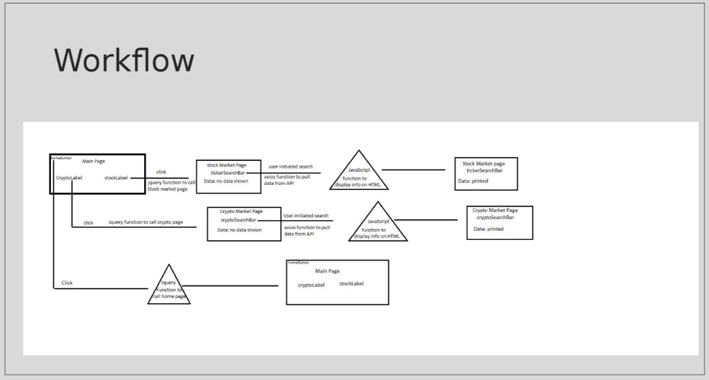
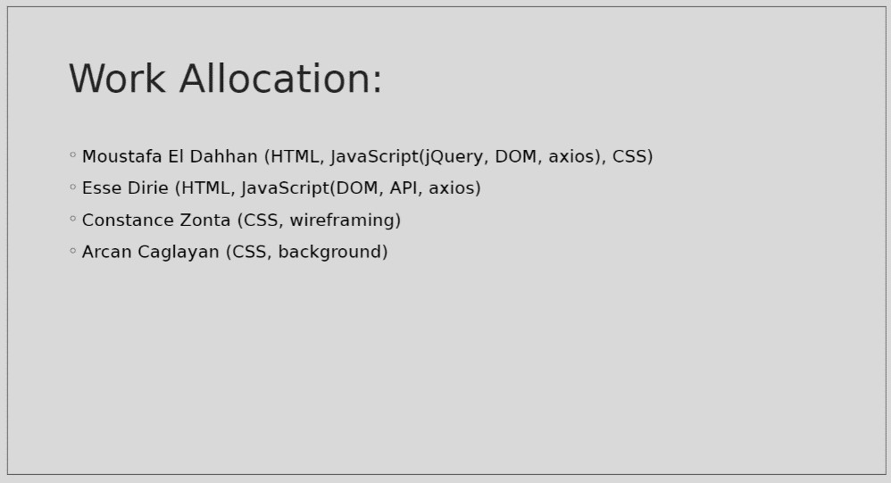

# Market Maestro

Group Project #1 - 

Project – Market Maestro
Description                                                                                                  
Our project allows user to be able to search any Crypto Currency or Stock data that will help a trader make decisions.  Data is presented to the user instantaneously.

Our UI

API Used
•	Alpha Vantage (Crypto)
•	Polygon (Stock)

=======

# CryptoMaestro
A website that will allow you to view the prices and statistics of most cryptocurrencies. The website will also allow you to view the NFT market and search up your favorite collections to keep up with their prices.
Work allocation:
- Moustafa (Java Script, HTML ,CSS)
- Constance (Wireframing)
- Esse (Java Script, HTML)
- Arcan (Background Image)

